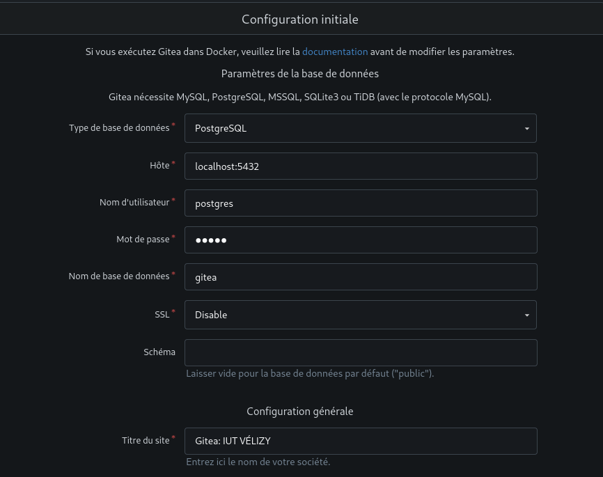

# <center> Manuel d'installation</center>
### <center>Guide d'installation de Gitea sur Debian</center>

(**Précision :** Les commandes écrites ci-dessous sont censées être exécutées par root, d'où l'absence de `sudo`)

## Installation de PostgreSQL

Pour installer le serveur PostgreSQL exécutez les commandes suivantes :
```bash
apt update
apt install postgresql-15
apt install postgres-client-15
systemctl status postgresql
systemctl start postgresql
apt install vim
vim /etc/postgresql/15/main/postgresql.conf

(enlever le "#" de la ligne)
#listen_addresses = '*'

systemctl restart postgresql
su - postgres #mot de passe par défaut : postgres
psql -c "ALTER USER postgres WITH password 'monMotDePasseSuperSecret';"
psql -c "CREATE DATABASE gitea;"
```
## Installation de Gitea

Pour installer le serveur Gitea exécutez les commandes suivantes :
```bash
adduser git
apt install git
wget -O gitea https://dl.gitea.com/gitea/1.22.6/gitea-1.22.6-linux-amd64
chmod +x gitea
mkdir /home/git/gitea
mv gitea /home/git/gitea
chown git:git -R /home/git/
```
Ensuite, pour que ce soit un daemon, il faut créer un fichier `/etc/systemd/system/gitea.service`
```bash
touch /etc/systemd/system/gitea.service
```
Et y copier ça, c'est un bout de code modifié trouvé sur le [Github de Gitea](https://github.com/go-gitea/gitea/blob/release/v1.22/contrib/systemd/gitea.service) :
```
[Unit]
Description=Gitea (Git with a cup of tea)
After=network.target

[Service]
RestartSec=2s
Type=simple
User=git
Group=git
WorkingDirectory=/home/git/gitea
ExecStart=/home/git/gitea/gitea 
Restart=always
Environment=USER=git HOME=/home/git GITEA_WORK_DIR=/home/git/gitea

[Install]
WantedBy=multi-user.target
```
Il faut maintenant recharger les daemons :
```bash
systemctl reload-daemon
```
Maintenant, on peut exécuter gitea en tant que service avec la commande :
```bash
systemctl start gitea
```

(Une fois sur http://localhost:3000/ renseigner les champs correspondant)


## Configuration de Gitea

On a le fichier `/home/git/gitea/custom/conf/app.ini`, voici un exemple avec des options par défaut
```ini
APP_NAME = La théière de l'IUT - B.U.Thé # Nom de l'application

[database]
DB_TYPE = postgres # Base de données PostgreSQL
HOST = 192.168.24.146:5432 # Adresse de la base de données
NAME = gitea # Nom de la base de donnée
USER = postgres # Nom d'utilisateur qui administre la BDD
PASSWD = monMotDePasseSuperSecret # Mot de passe de l'utilisateur qui administre la BDD

[log]
LEVEL = debug # Logs pour debuguer l'application

[service]
DISABLE_REGISTRATION = true # Si à "true" alors seul l'admin peut créer des utilisateurs

[security]
SECRET_KEY = zNfev6bUsqMhEM6AHy8xfXHPDvfkYEBhpRd1HOytelg= # Clé de chiffrement de l'application

[server]
SSH_DOMAIN = 192.168.24.146 # Adresse du service SSH
SSH_PORT = 2222 # Port du service SSH affiché au client (quand il voudra clone un repo avec SSH par exemple)
SSH_LISTEN_PORT = 2222 # Port du serveur SSH built-in (attention le port 22 rentre en conflit avec sshd)
DISABLE_SSH = false # Désactive ou non les connexions SSH
START_SSH_SERVER = true # Si activé, utilise le serveur SSH "built-in" de gitea
```

Pour chaque paramètre, une description du paramètre est proposée.