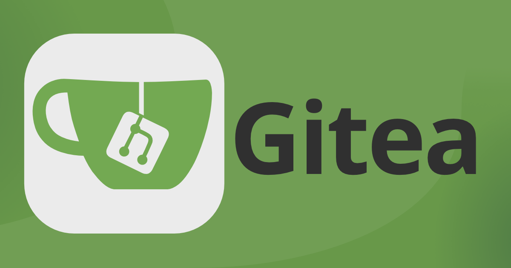

#  
SAE 5 Sujet 2 - Gitea 

## 📋 Description

**Gitea** est une plateforme open-source de gestion de code source basée sur **Git**. Ce projet a pour objectif de réaliser une étude complète de l'application **Gitea**, en l'installant et en la configurant sur un système Debian. Le travail inclut également la création de 3 travaux pratiques pour aider à l'apprentissage de **Git** et de **Gitea** pour des étudiants de première et deuxième année. Pour plus d'informations, un fichier `EtudeDesFonctionnalites.md` est disponible.

##  🔧 Installation et Configuration

### Installation de Gitea sur Debian

Les fichiers d'installation sont disponibles dans le dossier `Installation_Configuration/`, comprenant :
- Un **manuel d'installation sur Debian**.
- Un **manuel d'installation via Docker**.
- Un guide pour l'utilisation de **différents scripts**.

###  Administration de Gitea

Des **scripts d'administration** sont disponibles dans le répertoire `Scripts/Scripts_Configuration` pour faciliter la gestion de votre plateforme :
- Création d'utilisateurs.
- Suppression d'utilisateurs.
- Création du répertoire initial et de la branche pour le **TP1**.

##  🎓 Travaux Pratiques

Nous avons conçu **trois travaux pratiques** pour l'apprentissage de Gitea et de Git :
1. **Introduction à Git**
2. **Initiation aux tags et approfondissement de la gestion des branches**
3. **Gérer les commits avec Git**

Les détails des travaux pratiques sont disponibles dans les fichiers PDF situés dans le dossier `Livrables/`.

##  📚 Documentation et Livrables

Vous pouvez trouver la **documentation** et les **livrables** dans les répertoires suivants :
- **Installation et configuration** : `Scripts/Script_Installation/`.
- **Scripts d'administration** : `Scripts/Scripts_Configuration/`.
- **Versions PDF des documents, TPs, corrections des TPs et manuels** : `Livrables/`.

## 💻 Environnement et Compatibilité

Cette application est déployé sur les technologies suivantes :
- **Debian** (version 11 et ultérieures)
- **Docker** (pour une installation plus flexible)

Pour l'installation Docker, le script s'occupe d'installer les prérequis (dépendances comme que git et docker)

## 💾 Logiciels et Versions

Les versions des logiciels utilisés dans ce projet :
- **Gitea** : Dernière version stable
- **Debian** : 11
- **Docker** : Dernière version stable

## 🤝 Contributeurs

- **CHOISY Alexis**
- **DE SOUSA Florian**
- **MOUSSAMIH Elias**
- **PAVLETIC Thomas**
- **SOUMARE Sidy**
- **GRONDIN David**

---
