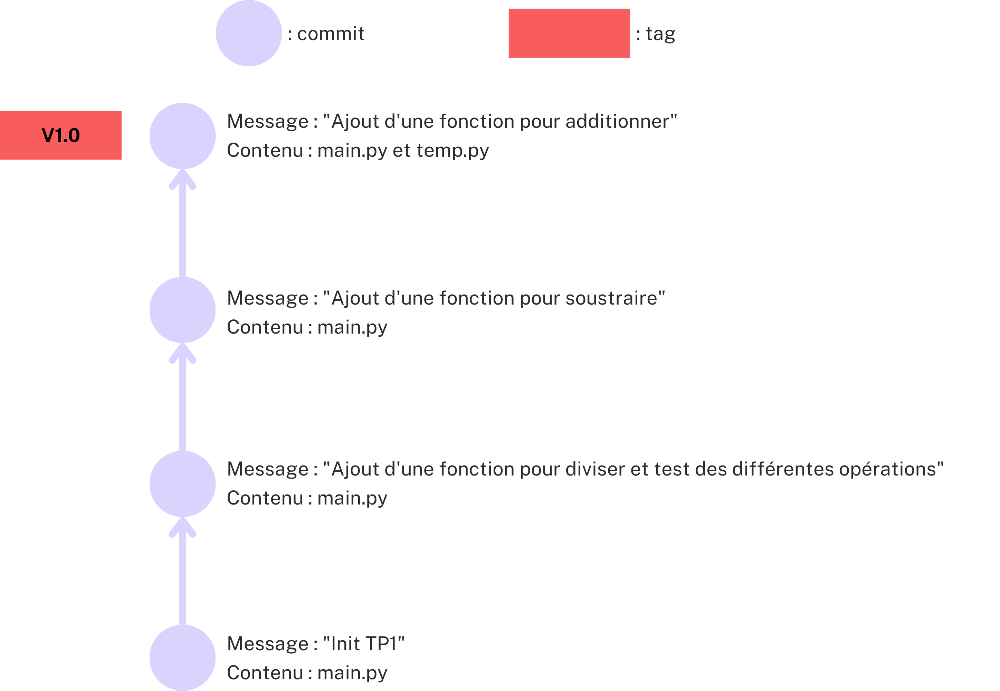
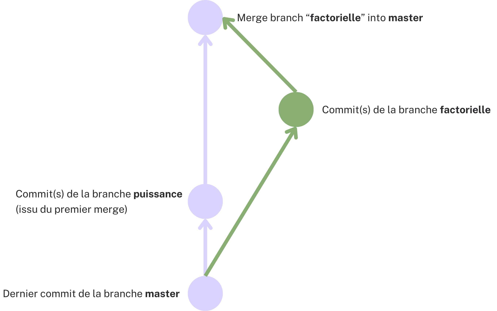

    <h2>TP 2 : Approfondissement de Git</h2>
    

  

Après avoir posé les bases lors du TP1, nous allons maintenant explorer des pratiques avancées
liées à l'utilisation des tags, des branches, des outils essentiels pour gérer efficacement le travail collaboratif dans un projet.
Nous allons explorer les différentes étapes pour créer, manipuler, comparer et fusionner des branches tout en identifiant
et en résolvant des conflits potentiels qui peuvent survenir. Ce TP vous permettra donc de renforcer vos connaissances de base tout en vous familiarisant
avec des concepts plus avancés de gestion de versions. N'hésitez pas à avoir votre cours de côté pour réaliser ce TP.

### I. Les tags
* **Question 1 :** Créer un tag léger nommé v1.0 sur le dernier commit de votre dépôt.
* **Question 2 :** Créer un fichier 'test.txt' et le commit.
* **Question 3 :** Créer un tag annoté nommé v1.1 avec le message : "Version avec un fichier txt"
* **Question 4 :** Afficher la liste des tags de votre dépôt.
* **Question 5 :** Afficher les informations détaillées du tag v1.1.
* **Question 6 :** Comparer les modifications entre deux tags, v1.0 et v1.1.
* **Question 7 :** Listez l’historique des commits correspondant au tag v1.0.
* **Question 8 :** Déposer le tag v1.0 sur le dépôt distant.
* **Question 9 :** Supprimer le fichier "test.txt" ainsi que le tag v1.1.

    
     
    Figure 1 : Illustration de l'état du dépot git à cet instant

### II. Les branches

#### Questions de cours
* **Question 1 :** Qu'est-ce qu'une branche dans Git ?
* **Question 2 :** Pourquoi utilise-t-on des branches dans un projet collaboratif ?
* **Question 3 :** Quelle est la différence entre la branche principale (main/master) et une autre branche ?

#### Questions d'introduction aux branches
* **Question 4 :** Créez 2 branches "Puissance" et "Factorielle" à partir de la branche précédente.
* **Question 5 :** Déplacez-vous dans la branche "Puissance".
* **Question 6 :** Listez toutes les branches existantes de votre dépot Git.
* **Question 7 :** (Attention n'oubliez pas de commit avant de changer de branche)
  - Dans la branche **puissance**, ajoutez une fonction "puissance(n,p)" dans le fichier "main.py" qui permet de calculer n puissance p.
  - Déplacez-vous dans la branche **factorielle**, ajouter une fonction "factorielle(n)" dans le fichier "main.py" qui permet de calculer la factorielle de n.
* **Question 8 :** Déplacez-vous dans la branche principale (main/master) et fusionnez les branches **puissance** et **factorielle** (le premier merge devrait bien se passer, le deuxième aura un conflit : expliquez pourquoi il y a eu un conflit).

    
     
    Figure 2 : Illustration de l'état du dépot git à ce moment

* **Question 9 :** Afficher l'historique de commits des branches "**Puissance**" et "**Factorielle**", puis comparer les differences entre elles.