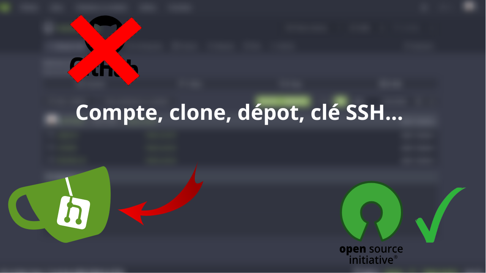

<div style="text-align: center;">
    <h2>TP 1 : Introduction à Git </h2>
    
</div> 

```
⚠️ Il faut réaliser ce TP uniquement en ligne de commande
```

### I. SSH keygen

Ssh-keygen est une commande utilisée pour générer une paire de clés SSH (clé publique, clé privée).
Ces clés sont utilisée principalement pour établir une authentification sécurisée sur des serveurs ou services
sans avoir besoin de taper un mot de passe.

#### Définition et fonctionnement

* **Clé privée :** Une clé privée est un code cryptographique connu uniquement par son propriétaire et permet de déchiffrer
  des messages cryptés à l'aide d'une clé publique correspondante.
* **Clé publique :** Une clé publique est utilisée pour crypter des informations que seul le propriétaire de la clé privée
  est autorisé à déchiffrer. Elle peut être partagée et est installée sur le serveur pour permettre à votre machine locale de s'authentifier.
  Elle ne nécessite pas de confidentialité, puisqu'elle est partagée librement.

##### Comment ça marche ?
Une clé publique est créé pour chiffrer des données et peut être partagée librement.<br>
La clé privée, gardée secrète, sert à déchiffrer les données.<br>
Les deux clés sont liées mathématiquement, mais une clé publique ne permet pas de retrouver sa clé privée.<br>

### II. Initiation à Git
* **Question 1 :** Se connecter sur gitea, (créer une clé SSH) et bifurquer (fork) la branche sur le dépôt distant de l'admin.
  * Vous avez à votre disposition une vidéo ici : [](https://www.youtube.com/watch?v=fNKjukZ7QRk)
```
git clone ssh://gitea@domain.tld:<port>/repo/my-project.git (à vérifier)
```
ou
```
git remote add origin http://<IPduGitea>:3000/<Utilisateur>/repotest.git
```
* **Question 2 :** Récupérez localement la branche **main**.
```
git pull origin main
git checkout main 
```

* **Question 3 :** Maintenant que vous avez récupéré la branche, vous allez devoir avancer sur le projet et coder la méthode pour faire une multiplication. N'oubliez pas de faire de commit les modification que vous avez fait.

Petite partie "cours", Il y a des conventions à respecter. Il faut garder en tête que le message de commit peut être n'importe quoi, mais qu'il est préférable d'écrire un message clair afin de pouvoir potentiellement revenir sur des modifications plus facilement. Généralement en entreprise, on a une branche dédiée à une UserStory et on précise l'identifiant de ce dernier pour un meilleur versionnage. Dans le cadre de ce cours, les user stories seront les TPs. Ainsi, pour ce TP et les suivants, il est attendu que vous renseignez **"TP1 : Description de ce qui a été fait"** dans vos commits.

Il est aussi courant d'utiliser des commentaires **"# TODO :" (ou // TODO : selon le langage)** dans le code. Cette convention permet de signaler des tâches à réaliser plus tard.
La plupart des **IDE** identifient automatiquement les **TODO** et les affichent dans une liste dédiée, ce qui aide à ne pas les oublier. Lors des commits, il est important de vérifier ces **TODO**.

Edition du fichier main.py :
```
def multiplication(a, b):
    return a * b
```
```
git add main.py
git commit m "TP1 : Ajout de la méthode multiplication(a, b)"
```
* **Question 4 :** Créez une branche locale à partir de **master** qui s'appelle "**TP1_VotreNomDeFamille**"
```
// Cette commande créé une branche uniquement
git branch TP1_NomDeFamille

ou

// Cette commande créé une branche et bascule directement sur cette branche
git checkout -b TP1_NomDeFamille
```
* **Question 5 :** Poussez les deux branches locales sur le dépôt distant
```
git push origin main
git push origin TP1_NomDeFamille
```