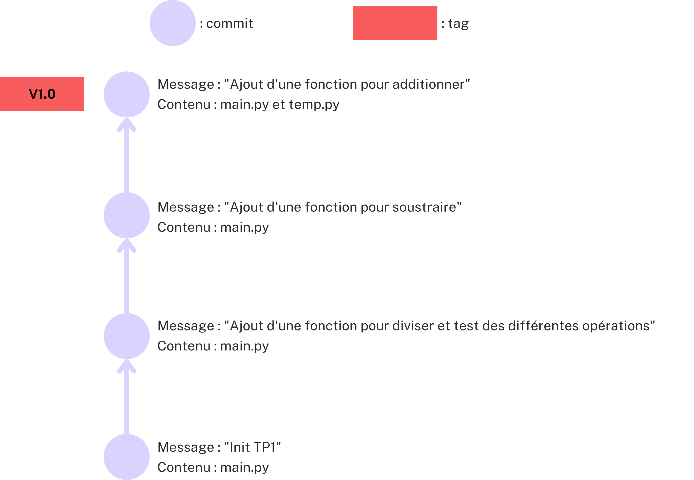
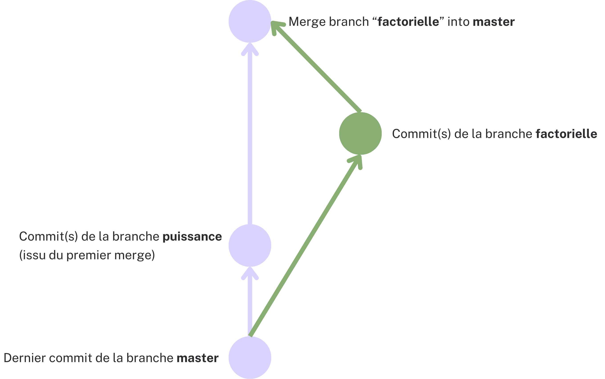

<div style="text-align: center;">
    <h2>TP 2 : Initiation aux tags et approfondissement de la gestion de branches</h2>
    
</div>  

Après avoir posé les bases lors du TP1, nous allons maintenant explorer des pratiques avancées
liées à l'utilisation des tags, des branches et des outils essentiels pour gérer efficacement le travail collaboratif dans un projet.
Nous allons explorer les différentes étapes pour créer, manipuler, comparer et fusionner des branches tout en identifiant
et en résolvant des conflits potentiels qui peuvent survenir. Ce TP vous permettra donc de **renforcer vos connaissances de base** tout en vous familiarisant
avec des concepts plus avancés de gestion de versions. N'hésitez pas à avoir votre cours de côté pour réaliser ce TP. **Et n'oubliez pas de mettre en pratique ce que vous avez appris lors du TP1**.

### I. Les tags
* **Question 1 :** Créer un tag léger nommé **v1.0** sur le dernier commit de votre dépôt.
```
git tag v1.0
```
* **Question 2 :** Créer un fichier **test.txt** et le commit.
```
touch test.txt # Sur linux
echo '' > test.txt # Sur windows

==> Il peut très bien créer le fichier sans ligne de commande
```
```
git add test.txt 
git commit -m "TP2 : Ajout du fichier test.txt"
```
* **Question 3 :** Créer un tag annoté nommé **v1.1** avec le message : "TP2 : Version avec un fichier txt"
```
git tag -a v1.1 -m "TP2 : Version avec un fichier txt"
```
* **Question 4 :** Afficher la liste des tags de votre dépôt.
```
git tag
```
* **Question 5 :** Afficher les informations détaillées du tag **v1.1**.
```
git show v1.1
```
* **Question 6 :** Comparer les modifications entre deux tags, **v1.0** et **v1.1**.
```
git diff v1.0 v1.1
```
* **Question 7 :** Listez l’historique des commits correspondant au tag **v1.0**.
```
git log v1.0
```
* **Question 8 :** Déposer le tag **v1.0** sur le dépôt distant.
```
git push origin v1.0
 ```
* **Question 9 :** Supprimer le fichier **test.txt** ainsi que le tag **v1.1**.
```
//Supprimer le fichier
git rm test.txt 
git commit -m "TP2 : Suppression du fichier test.txt"

//Supprimer le tag
git tag -d v1.1

//Supprimer le tag sur un dépot distant (pas besoin dans notre cas)
git push origin --delete v1.1
 ```


<div style="text-align: center;">
    
    <br>
    Figure 1 : Illustration de l'état du dépot git à cet instant
</div>


### II. Les branches

#### Questions de cours
* **Question 1 :** Qu'est-ce qu'une branche dans Git ?
```
Toute branche découle de la branche principale (appelée master ou main) et a pour but de développer une fonctionnalité spécifique d’un projet.
```
* **Question 2 :** Pourquoi utilise-t-on des branches dans un projet collaboratif ?
```
On utilise des branches dans un projet collaboratif car en général, on protège la branche principale pour qu'elle reste fonctionnelle et on travaille seul sur sa propre branche pour éviter d’écraser le travail des autres. C'est pourquoi il est utile de créer des branches dérivées, qui seront fusionnées une fois la fonctionnalité développée
```
* **Question 3 :** Quelle est la différence entre la branche principale (**main/master**) et une autre branche ?
```
La branche principale est destinée au code stable et en production, tandis que les autres branches servent au développement et à l'expérimentation. Cette différence entre ces 2 types de branches permet de travailler de mainière organisé et sécurisé.
```

#### Questions d'introduction aux branches
* **Question 4 :** Créez 2 branches **TP2_Puissance** et **TP2_Factorielle** à partir de la branche précédente. Comme précisé dans le cours, c'est une bonne pratique d'avoir un identifiant d'une User Story dans le nom de la branche. On considèrera qu'un TP équivaut à une User Story.
```
git branch TP2_Puissance 
git branch TP2_Factorielle
```

* **Question 5 :** Déplacez-vous dans la branche **TP2_Puissance**.
```
git checkout TP2_Puissance
```

* **Question 6 :** Listez toutes les branches existantes de votre dépot local.
```
git branch
```

* **Question 7 :** (Attention n'oubliez pas de commit avant de changer de branche)
  - Dans la branche **TP2_Puissance**, ajoutez une fonction "puissance(n, p)" dans le fichier "main.py" qui permet de calculer n puissance p.

    Edition du fichier main.py :
    ```
    //Fonction puissance
    def puissance(n, p):
      return n ** p
    ```
    ```
    git add main.py 
    git commit -m "Ajout de la fonction puissance(n, p)"
    ```
  - Dans la branche **TP2_Factorielle**, ajouter une fonction "factorielle(n)" dans le fichier "main.py" qui permet de calculer la factorielle de n.
    ```
    git checkout TP2_Factorielle
    ```
    Edition du fichier main.py :
    ```
    //Fonction factorielle
    def factorielle(n): 
      if n == 0: 
        return 1 
      return n * factorielle(n - 1)
    ```
    ```
    git add main.py 
    git commit -m "Ajout de la fonction factorielle(n)"
    ```

* **Question 8 :** Déplacez-vous dans la branche principale (**main/master**) et fusionnez les branches **TP2_Puissance** et **TP2_Factorielle** (le premier merge devrait bien se passer, le deuxième aura un conflit : expliquez pourquoi il y a eu un conflit).
```
git checkout main
git merge TP2_Puissance
git merge TP2_Factorielle
```
Pour résoudre le conflit lors du second merge, ouvrir manuellement le fichier main.py et supprimer les lignes qui posent un problème :
```
<<<<<<< HEAD 
def puissance(n, p): 
  return n ** p 
=======
def factorielle(n): 
  if n == 0: 
    return 1 
  return n * factorielle(n - 1)
>>>>>>> TP2_Factorielle
```
Deviendrait
```
def puissance(n, p): 
  return n ** p 

def factorielle(n): 
  if n == 0: 
    return 1 
  return n * factorielle(n - 1)
```
```
git add main.py 
git commit "
```
<div style="text-align: center;">
    
    <br>
    Figure 2 : Illustration de l'état du dépot git à ce moment
</div>

#### Comparaison des branches
* **Question 9 :** Afficher l'historique de commits des branches **TP2_Puissance** et **TP2_Factorielle**, puis comparer les differences entre elles.
```
git log TP2_Puissance
git log TP2_Factorielle
git diff TP2_Puissance TP2_Factorielle
```