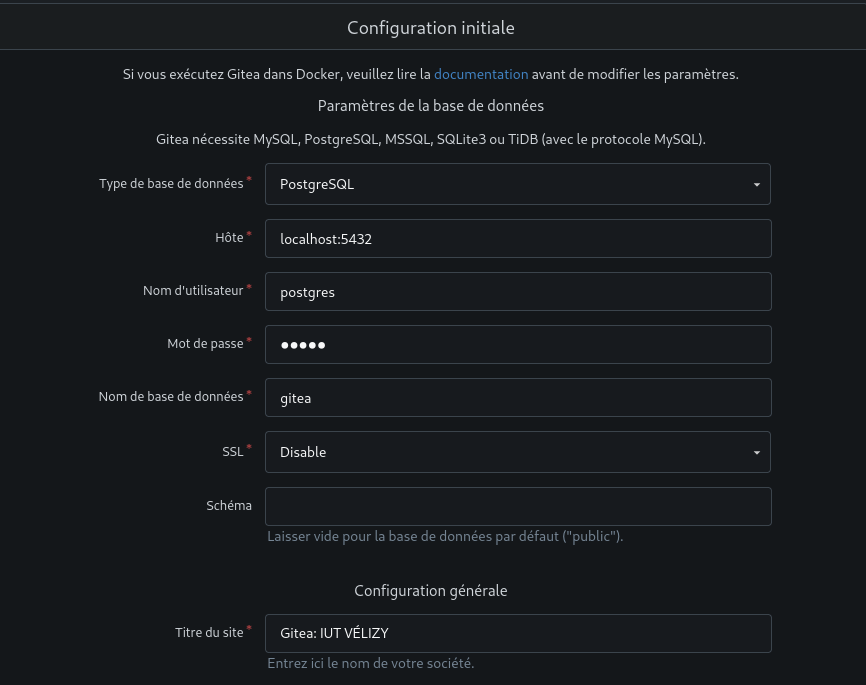

# <center> Manuel d'installation</center>
### <center>Guide d'installation de Gitea sur Debian</center>

(**Précision :** Les commandes écrites ci-dessous sont censée être exécuter par root, d'où l'absence de `sudo`)

## Installation de PostgreSQL

Pour installer le serveur PostgreSQL, exécutez le script d'installation associé `postgresql_install.sh` ou exécuter les commandes suivantes :
```bash
apt update
apt install postgresql-15
apt install postgres-client-15
systemctl status postgresql
systemctl start postgresql
apt install vim
vim /etc/postgresql/15/main/postgresql.conf

(enlever le "#" de la ligne)
#listen_addresses = '*'

systemctl restart postgresql
su - postgres #mot de passe par défaut : postgres
psql -c "ALTER USER postgres WITH password 'monMotDePasseSuperSecret';"
psql -c "CREATE DATABASE gitea;"
```
## Installation de Gitea

Pour installer le serveur Gitea, exécutez le script d'installation associé `gitea_install.sh` ou exécuter les commandes suivantes :
```bash
adduser git
apt install git
wget -O gitea https://dl.gitea.com/gitea/1.22.6/gitea-1.22.6-linux-amd64
chmod +x gitea
mkdir /home/git/gitea
mv gitea /home/git/gitea
chown git:git -R /home/git/
```
après pour que ce soit un daemon il faut créer un fichier `/etc/systemd/system/gitea.service`
```bash
touch /etc/systemd/system/gitea.service
```
et y copier ça, c'est un bout de code modifié trouvé sur le [Github de Gitea](https://github.com/go-gitea/gitea/blob/release/v1.22/contrib/systemd/gitea.service):
```
[Unit]
Description=Gitea (Git with a cup of tea)
After=network.target

[Service]
RestartSec=2s
Type=simple
User=git
Group=git
WorkingDirectory=/home/git/gitea
ExecStart=/home/git/gitea/gitea 
Restart=always
Environment=USER=git HOME=/home/git GITEA_WORK_DIR=/home/git/gitea

[Install]
WantedBy=multi-user.target
```
il faut maintenant recharger les daemon:
```bash
systemctl reload-daemon
```
maintenant on peut exécuter gitea en tant que service avec la commande:
```bash
systemctl start gitea
```

(une fois sur http://localhost:3000/ renseigner les champs correspondant)


## Configuration de Gitea

Affin d'exécuter le script, il est nécessaire d'avoir installé `curl`:
```bash
apt install curl
```
Maintenant que Gitea est installé, le premier utilisateur créé sera l'admin.
Une fois celui-ci créé vous pouvez exécuter le script `scripts/script_creation.sh` qui va créer les comptes utilisateurs en fonction
d'un fichier sous format `csv` (⚠️ Attention à bien exécuter le script dans le même répertoire que celui-ci ⚠️) le fichier `csv` doit contenir ces headers :
```csv
login;password;email;fullname
```
avec login étant le numéro étudiant de l'élève

## Conseil concernant la sécurité